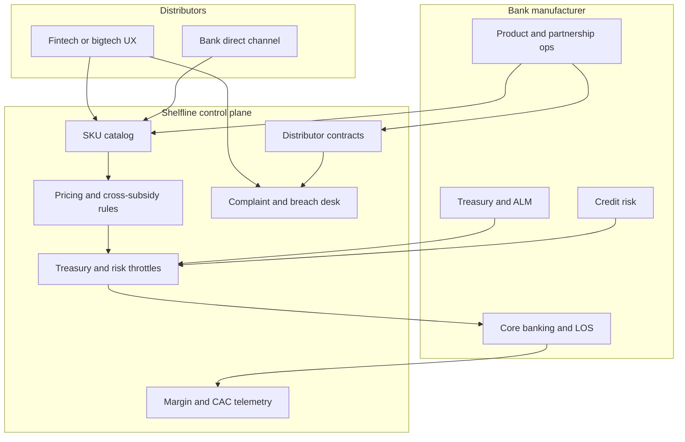

# Shelfline

**Source:** `ai-in-financial/WEF_The_future__of_financial_services/`
**Domain:** `ai-fin`
**One-liner:** A banking-as-a-platform product shelf that lets incumbent manufacturers publish capital-aware deposit, lending, and payment SKUs for third-party distributors — without silently destroying net interest margin through uncontrolled unbundling.
**Wedge:** Regional and global retail banks executing the report’s “parallel strategies” — compete with new entrants while also supplying them infrastructure — starting with deposit and unsecured lending products distributed via fintech and bigtech channels.
**Positioning:** Manufacturing-and-distribution control plane for the unbundled bank. The 2015 WEF Future of Financial Services taxonomy shows the greatest near-term disruption in banking and platform-based, data-intensive, capital-light models; Shelfline is how a bank remains the risk and capital principal while distributors own experience — with explicit rules for cross-subsidy, CAC, and franchise value.

## Market research synthesis

### Thesis from source

After 15 months of research, 100+ innovator interviews, and six multi-stakeholder workshops with 300+ participants, the Forum published the first consolidated taxonomy of disruptive innovation across six FS functions (payments, insurance, deposits & lending, capital raising, investment management, market provisioning) and eleven innovation clusters. Six high-level insights frame strategy: innovation attacks where customer friction meets large profit pools; platform-based, data-intensive, capital-light models hit hardest; banking feels disruption first while insurance may feel the greatest eventual impact; incumbents will run parallel strategies (compete and provide infrastructure); regulators must co-understand changing risk; and disruption is continuous pressure, not a single event.

In deposits and lending, alternative adjudication and P2P platforms transform origination and open consumer lending to non-traditional capital, while “Banking as Platform (API)” and virtual banking force incumbents to reconsider roles. Implications are blunt: intensified competition narrows the spread between deposits and loans; stand-alone product offers limit competitive cross-subsidy; savers moving to alternative platforms erode traditional deposits; credit portfolios spread across platforms obscure creditworthiness; and institutions must choose where to specialise versus leverage partners (product manufacturing vs customer experience). Payments scenarios include consolidation, fragmentation, and credit-card displacement by data-driven engagement platforms; merchant relationships and preferred-rail status become strategic. Market provisioning notes information platforms evolving best-execution standards.

Shelfline’s job is therefore not “open banking compliance.” It is to make manufacture-versus-distribute an operable commercial system: SKUs with capital and liquidity constraints, distributor contracts with experience-ownership and branding rules, pricing that protects NIM and fee income deliberately, and telemetry when partner channels consume franchise value faster than they buy volume.

### Buyer & economic model

- **Primary buyer:** Head of Platform / Partnerships or Chief Product Officer for retail banking, with CFO and Treasury as economic co-sponsors.
- **Users:** product managers (SKU publishing), partnership managers (distributor contracts), treasury/ALM analysts (deposit and liquidity constraints), credit risk (lending appetite), finance (margin and CAC), distributor developers (API integration).
- **Budget owner / value metric:** product P&L and deposit franchise value. Metrics: partner-originated volume, contribution margin after capital/liquidity cost, CAC by distributor segment, deposit beta/attrition on partner-sourced balances, and share of products sold stand-alone vs bundled.
- **Competing status quo:** bespoke bilateral partner integrations, marketing “API portal” without capital rules, marketplace aggregators that set customer experience unilaterally, and internal product factories that cannot quote a clean manufacturing price to external channels.

### Domain constraints

- **Regulatory / trust / safety:** consumer duty and fair marketing when distributors present bank products; outsourcing and responsibility maps; credit decision explainability if adjudication is shared; deposit protection disclosures; best-execution analogues for rate presentation; AML still attaches to the balance-sheet principal.
- **Data sensitivity:** applicant and account data shared with distributors under purpose limitation; competitive rate cards; partner performance data that could reprice the relationship.
- **Change-management realities:** business lines fear platform teams “giving away the bank”; distributors demand UX control; treasury fears uncontrollable deposit flight. Shelfline must make capital and liquidity constraints visible in every SKU publish — not a PDF policy beside the API.

## Business requirements

- BR-1: Every published SKU must declare whether the bank is manufacturer (balance-sheet principal), distributor, or both, and must name the capital and liquidity constraints that bound volume.
- BR-2: Distributors must receive a manufacturing price / revenue share that finance can map to NIM, fee income, and cost-to-income — not an opaque “partner deal.”
- BR-3: Experience-ownership rules (branding, recommendation bias limits, complaint ownership) must be contractual fields enforceable in the shelf, not side letters.
- BR-4: Lending SKUs must expose adjudication boundaries: bank-decided, partner-decided within bank policy, or dual-control — with auditability for adverse decisions.
- BR-5: Deposit SKUs must enforce treasury caps and early-warning when partner-sourced balances breach concentration or beta assumptions.
- BR-6: The bank must be able to pause a distributor or SKU within a defined SLA without a code deploy, when conduct, fraud, or liquidity thresholds trip.
- BR-7: Cross-subsidy between products must be explicit: stand-alone shelf pricing cannot silently assume bundled current-account economics the distributor does not carry.
- BR-8: CAC and contribution margin must be reportable by distributor and segment monthly, suitable for kill-or-scale decisions.
- BR-9: Customer complaints on partner-distributed products must route to a named accountable party with time-boxed redress, visible to the bank’s conduct team.
- BR-10: Rate and fee presentation to end customers must meet disclosure rules; shadow discounting by distributors outside approved bands is a breach event.
- BR-11: Parallel-strategy mode must allow the bank to list its own direct channel alongside external distributors without preferential data leakage that creates unfair competition claims.
- BR-12: Creditworthiness signals from multi-platform borrowing (where legally obtainable) must be ingestible so partner-originated books do not blind the bank to total leverage.

## User stories

Canonical user stories live in sibling [USER_STORIES.md](USER_STORIES.md).

## System design

### Overview

Shelfline is the bank’s product shelf and partner control plane. Product teams publish SKUs with economic and risk metadata. Partnerships bind distributors to contracts (brand, complaints, revenue share). Distributors browse the catalog, originate or embed products via APIs, and receive adjudication outcomes per configured mode. Treasury and risk caps throttle volume. Finance telemetry attributes margin and CAC. Conduct tooling assigns complaint ownership and breach events (shadow pricing, disclosure failures).

### Actors & boundaries

- **Actors:** bank manufacturer, bank direct channel, external distributors, end customers, treasury, credit risk, conduct, Shelfline operator.
- **Trust boundary:** customer funds and credit risk remain on the bank (or named balance-sheet partner). Distributors hold UX and first-line customer interaction under contract. Shelfline brokers catalog, policy, and telemetry — it is not a shadow bank.
- **Human-in-the-loop points:** new distributor underwriting; SKU capital limit changes; adverse lending appeals; conduct breach adjudication; emergency pauses.

### Core capabilities

1. **SKU publishing** — deposit, lending, payment products with constraints.
2. **Distributor registry and contracts** — experience ownership, revenue share, branding.
3. **Catalog and embed APIs** — partner-facing product discovery and origination.
4. **Adjudication mode control** — bank / partner / dual-control credit decisions.
5. **Treasury and risk throttles** — caps, concentration, beta alarms.
6. **Pricing and cross-subsidy rules** — manufacturing price, approved bands.
7. **Margin and CAC telemetry** — partner economic scorecards.
8. **Complaint and accountability routing** — named owners, SLAs.
9. **Breach and pause controls** — shadow pricing, fraud, liquidity.
10. **Multi-platform exposure ingest** — total borrower leverage signals.

### Conceptual data

- **Primary entities:** ProductSku, CapitalConstraint, LiquidityCap, Distributor, DistributionContract, RateCard, OriginationApplication, AdjudicationDecision, ThrottleEvent, MarginSnapshot, CacReport, ComplaintCase, BreachEvent, ExposureSignal.
- **Critical events:** SKU published/paused, contract activated, application submitted, decision rendered, throttle fired, complaint opened, breach recorded, exposure block.
- **Retention / audit needs:** rate cards, decisions, contracts, and complaint records retained for conduct and credit audit windows; partner telemetry aggregated for commercial review.

### Integrations (conceptual)

- **Systems of record:** core banking, loan origination, treasury ALM, general ledger.
- **Upstream signals:** credit bureaus, open-banking leverage signals, fraud vendors, distributor KYC outcomes.
- **Downstream actions:** account opening, loan booking, partner webhooks, finance dashboards, conduct case systems.

### High-level architecture

Catalog and policy are the control plane; origination is the data plane. Throttles sit in front of booking so partner growth cannot outrun capital.

### Success metrics

- **Leading:** time-to-publish a SKU; % partner originations within capital caps; throttle events caught pre-booking; contract completeness score (brand, complaints, share).
- **Lagging:** partner-originated contribution margin; deposit franchise value (partner vs direct beta/attrition); cost-to-income on platform-distributed products; conduct breaches per partner; stand-alone vs bundled mix versus plan.

## OpenAPI skeleton

Canonical HTTP surface lives in sibling [openapi.yaml](openapi.yaml). Summary:

- **Base path:** `/v1/...`
- **Auth:** `X-API-Key` for distributor integration; Bearer JWT for bank operators.
- **Resource groups:** Skus, Distributors, Originations, Throttles, Telemetry, Complaints, Breaches.
