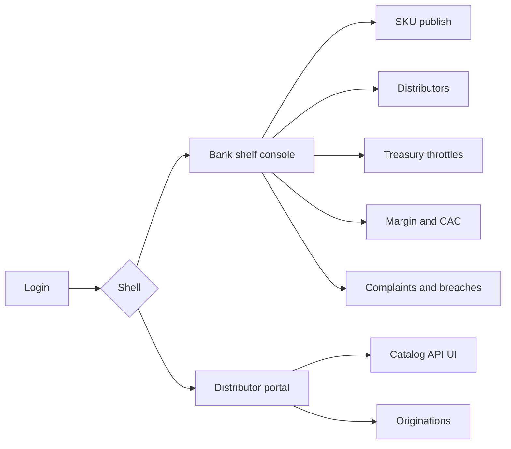
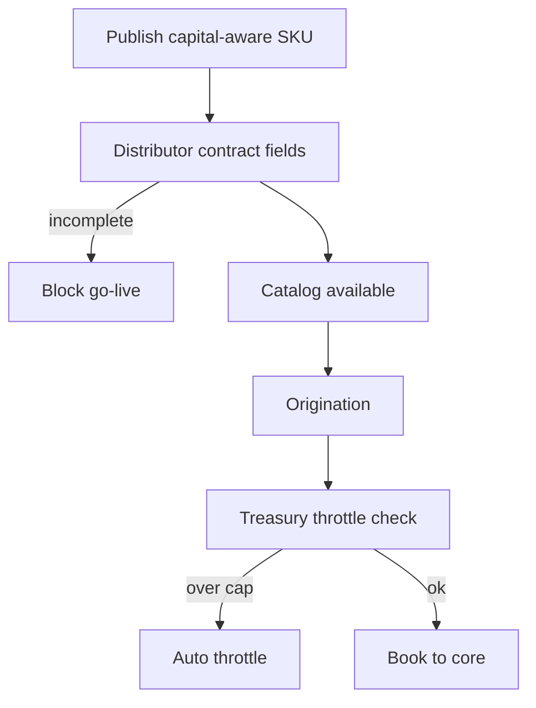

# Shelfline — Web app

**Product:** [PRODUCT.md](./PRODUCT.md)
**Primary surface:** Bank manufacturing shelf console (product / partnerships / treasury / credit / conduct)
**Secondary surfaces:** Distributor developer catalog portal; bank direct-channel catalog (parallel strategy)
**Design thesis:** Shelfline is a warehouse price list for capital — the UI metaphor is SKU publishing with ALM locks and distributor contracts, not an open-banking glossy API portal. Visual language is warm graphite and safety-yellow throttle marks on cool white catalog sheets: manufacturing price feels explicit; deposit caps feel like hard warehouse limits; shadow pricing feels like a breach siren. The Shelfline wordmark sits as a quiet manufacturer stamp on every SKU and pause screen so partners know whose balance sheet and NIM they are distributing—and that the shelf can close without a code deploy.

## UX research synthesis

### Category peers (best-in-class)

- **Stripe Connect / platform product dashboards:** Clear catalog, pricing, and partner controls with kill switches. Steal: pause distributor without deploy (BR-6); reject treating bank capital like SaaS seats.
- **Plaid / open-banking developer portals:** Stable catalog APIs and error codes for pending states. Steal: distributor developer UX with clear adjudication pending codes; reject compliance theatre without capital metadata on SKUs.
- **Alliora / partnership OS (sibling category):** Experience-ownership as structured fields. Steal: brand/complaints/liability in contract objects (BR-3); reject logo-partner walls as strategy.
- **Treasury ALM / deposit concentration tools:** Caps and early-warning. Steal: hard caps and auto-throttle on partner-sourced balances (BR-5); reject PDF policy beside the API.

### Patterns to adopt / reject

- **Adopt:** SKU declares manufacturer/distributor role + capital/liquidity bounds; manufacturing price mapped to NIM/fees; experience-ownership contractual fields; adjudication modes; treasury caps with auto-throttle; pause SLA; explicit cross-subsidy; CAC/margin by distributor; complaint ownership; shadow-pricing breach; parallel direct+partner without preferential data leakage; multi-platform leverage blocks.
- **Reject:** API portal vanity without capital rules; purple “platform bank” gradients; silent bundled economics on stand-alone shelf; preferential leakage to direct channel that creates unfair competition claims.

### Trust, density, and workflow constraints from PRODUCT.md

Customer funds and credit risk stay on bank balance sheet (trust boundary). Consumer duty when distributors present products; AML attaches to principal. Business lines fear “giving away the bank”; treasury fears deposit flight — constraints must be in every SKU publish. Parallel strategy requires fair catalog treatment (BR-11).

## Information architecture

### Nav model

### Roles → default home

| Role | Default home | Why |
|------|--------------|-----|
| Bank product manager | SKU publish board | Caps, floors, adjudication (BR-1, BR-4) |
| Partnerships lead | Distributor contracts | Brand/complaints before go-live (BR-3) |
| Treasury / ALM | Throttles and caps | Franchise/liquidity (BR-5) |
| Credit risk | Origination / exposure blocks | Multi-platform leverage (BR-12) |
| Finance | Margin and CAC telemetry | Kill/scale partners (BR-8) |
| Conduct | Complaints and breaches | Accountability (BR-9, BR-10) |
| Distributor developer | Catalog portal | Embed without emailing a banker |

### Cross-links to OpenAPI resources

| Nav area | OpenAPI tags / resources |
|----------|---------------------------|
| Product SKUs / catalog | Skus |
| Partner registry / contracts | Distributors |
| Applications / adjudication | Originations |
| Caps / concentration | Throttles |
| Margin / CAC | Telemetry |
| Redress ownership | Complaints |
| Shadow pricing / conduct | Breaches |

## Screen inventory

### Bank shelf home

- **Purpose:** Answer “which SKUs are live, throttled, or paused — and is partner volume earning its capital?”
- **Entry:** Product/partnerships default.
- **Layout regions:** Brand stamp; SKU status strip; partner volume vs caps; margin pulse; breach/pause alerts.
- **Primary actions:** Publish SKU; pause distributor; open telemetry; open breach.
- **Empty / loading / error:** Empty = publish first capital-aware SKU; error = retry with request id.
- **BR / story ties:** BR-1, BR-8; product manager stories.

### SKU publisher

- **Purpose:** Deposit/lending/payment SKU with role, capital/liquidity bounds, price floor, adjudication mode, cross-subsidy flags.
- **Entry:** Skus nav; create CTA.
- **Layout regions:** Role (manufacturer/distributor/both); capital/liquidity constraints; manufacturing price; rate/fee bands; adjudication mode; cross-subsidy declaration; audit log of publishes.
- **Primary actions:** Publish; version; pause SKU; clone.
- **Empty / loading / error:** Missing capital bounds or role = cannot publish (BR-1, BR-7).
- **BR / story ties:** BR-1, BR-2, BR-4, BR-7.

### Distributor registry and contracts

- **Purpose:** Bind experience ownership (branding, recommendation bias limits, complaints) and revenue share before go-live.
- **Entry:** Partners nav.
- **Layout regions:** Distributor table; contract fields completeness score; branding rules; complaint owner; share schedule; activation status.
- **Primary actions:** Activate; amend; pause; export contract pack.
- **Empty / loading / error:** Incomplete ownership fields block go-live (BR-3).
- **BR / story ties:** BR-3; partnerships stories.

### Distributor catalog portal

- **Purpose:** Stable approved SKUs and rate cards for embed; clear errors when bank-side adjudication pending.
- **Entry:** Distributor developer login.
- **Layout regions:** Catalog list; rate card; integration keys; sandbox; error-code reference; no preferential host-only secret SKUs beyond policy (BR-11).
- **Primary actions:** Browse; subscribe webhooks; test originate.
- **Empty / loading / error:** Pending adjudication = explicit code, not spinner void.
- **BR / story ties:** Distributor developer stories; BR-11.

### Origination and adjudication

- **Purpose:** Partner applications with bank / partner-within-policy / dual-control modes; audit adverse decisions.
- **Entry:** Originations; credit risk.
- **Layout regions:** Application queue; mode badge; decision trail; exposure signal panel; adverse action notice.
- **Primary actions:** Decide; dual-control approve; block on leverage; handoff to core.
- **Empty / loading / error:** Saturated leverage = block (BR-12).
- **BR / story ties:** BR-4, BR-12.

### Treasury throttles

- **Purpose:** Hard caps by tenure/band; early warning; auto-throttle before month-end surprise.
- **Entry:** Treasury home.
- **Layout regions:** Cap matrix; utilisation; beta assumptions; throttle event log; SKU throttle preview.
- **Primary actions:** Set cap; acknowledge warning; force throttle; release.
- **Empty / loading / error:** Approaching cap = amber; breach path = auto throttle (BR-5).
- **BR / story ties:** BR-5; treasury stories.

### Pause controls

- **Purpose:** Pause distributor or SKU within SLA without code deploy on conduct/fraud/liquidity trips.
- **Entry:** Alerts; partnerships; shelf home.
- **Layout regions:** Pause targets; reason codes; SLA timer; cascade impact (in-flight apps).
- **Primary actions:** Pause; resume with approval; notify distributor.
- **Empty / loading / error:** Pause confirm is blocking and logged (BR-6).
- **BR / story ties:** BR-6.

### Margin and CAC telemetry

- **Purpose:** Contribution margin and CAC by distributor/segment monthly for kill-or-scale.
- **Entry:** Finance home.
- **Layout regions:** Scorecards; stand-alone vs bundled mix; capital cost allocation; kill/scale recommendations.
- **Primary actions:** Export; mark kill/scale; open partner review.
- **Empty / loading / error:** Insufficient month = empty chart (BR-8).
- **BR / story ties:** BR-8; product manager margin story.

### Complaints desk

- **Purpose:** Named accountable party and time-boxed redress visible to bank conduct.
- **Entry:** Conduct; partner-routed cases.
- **Layout regions:** Case queue; ownership from contract; SLA; evidence of customer conversation owner.
- **Primary actions:** Assign; escalate; close; evidence pack.
- **Empty / loading / error:** Unowned complaint = coral (BR-9).
- **BR / story ties:** BR-9.

### Breach desk (shadow pricing / disclosure)

- **Purpose:** Shadow discounting outside bands and disclosure failures as breach events.
- **Entry:** Conduct; monitoring alerts.
- **Layout regions:** Breach queue; rate presentation evidence; auto-pause suggestion; remediation.
- **Primary actions:** Record breach; pause distributor; remediate.
- **Empty / loading / error:** Empty = healthy (BR-10).
- **BR / story ties:** BR-10.

### Parallel channel fairness

- **Purpose:** Bank direct listed alongside distributors without preferential data leakage.
- **Entry:** Platform admin; audit.
- **Layout regions:** Channel compare; data-access matrix; fairness attestation.
- **Primary actions:** Attest; remediate leakage; audit export.
- **Empty / loading / error:** Leakage finding = breach-linked (BR-11).
- **BR / story ties:** BR-11.

## Key flows

1. **Publish and distribute** — define SKU with capital bounds → contract distributor → catalog live → originate within caps; failure: incomplete contract or missing bounds.

2. **Deposit cap approach** — utilisation warning → auto-throttle SKU → treasury review (BR-5).

3. **Fraud/liquidity pause** — trip → pause distributor in one action → notify → resume with approval (BR-6).

4. **Kill/scale partner** — monthly CAC/margin → kill or scale decision → contract amend (BR-8).

5. **Shadow pricing breach** — detect out-of-band discount → breach event → pause → remediate (BR-10).

## Design system

### Tokens (CSS variables)

- `--color-ink: #12141A` — text
- `--color-sheet: #F5F6F8` — catalog sheet ground
- `--color-graphite: #2A2E36` — shell
- `--color-safety: #E6B422` — throttle / warning
- `--color-breach: #D94A3D` — pause / breach
- `--color-clear: #2F8F6D` — within cap / live
- `--color-steel: #6B7380` — secondary labels
- `--font-display: "DM Sans", sans-serif` — shelf titles (industrial catalog, not Inter)
- `--font-body: "IBM Plex Sans", sans-serif`
- `--font-mono: "IBM Plex Mono", monospace` — SKU codes, rate cards
- `--space-1`…`--space-8`: 4px scale
- `--radius-sm: 4px`; `--radius-md: 8px`
- `--motion-throttle: 200ms ease-in-out` — cap warning
- `--motion-pause: 160ms ease-out` — pause engage
- `--motion-publish: 180ms ease-out` — SKU live flash
- Atmosphere: warehouse-sheet white on graphite; safety-yellow throttle marks; manufacturer stamp; no purple platform-bank nebula; no fintech logo mural.

### Typography & brand

- DM Sans for SKU titles; Plex for tables; mono for SKU ids and rates.
- Shelfline manufacturer stamp on publish and pause views; distributor portal brand co-presence under contract rules; login headline (“Capital-aware shelf for banking-as-a-platform”); one CTA.

### Do / don’t

- **Do:** Show capital/liquidity on every SKU; manufacturing price explicit; pause without deploy; throttle before ALM surprise; name complaint owners.
- **Don’t:** Purple API hero; vanity partner counts; silent cross-subsidy; preferential secret SKUs for direct only; emoji status; card walls of partner logos.

### Accessibility & domain trust cues

- Throttle/pause states text + colour; live regions for pause and cap breach.
- Focus order: SKU → contract → catalog → origination → throttle → telemetry.
- Distributor portal keyboard-complete error codes.

## Component patterns

- **SkuCapitalBadge** — manufacturer role + capital/liquidity bounds.
- **ManufacturingPriceLine** — NIM/fee-mappable share.
- **ExperienceContractFields** — brand, bias limits, complaint owner.
- **AdjudicationModeChip** — bank / partner-in-policy / dual-control.
- **DepositCapMeter** — utilisation vs treasury cap.
- **PauseDistributorControl** — one-action pause with SLA.
- **MarginCacScorecard** — partner economics for kill/scale.
- **ComplaintOwnerBanner** — named accountable party + timer.
- **ShadowPricingBreachRow** — out-of-band rate event.
- **ExposureBlockBadge** — multi-platform leverage stop.
- **FairChannelMatrix** — direct vs partner data access attestation.

## Out of scope for v1 web

- Replacing core banking or LOS; full open-banking regulatory reporting suite; consumer banking app UI beyond distributor embed; native mobile; becoming a shadow bank; marketplace that sets rates unilaterally outside approved bands.
